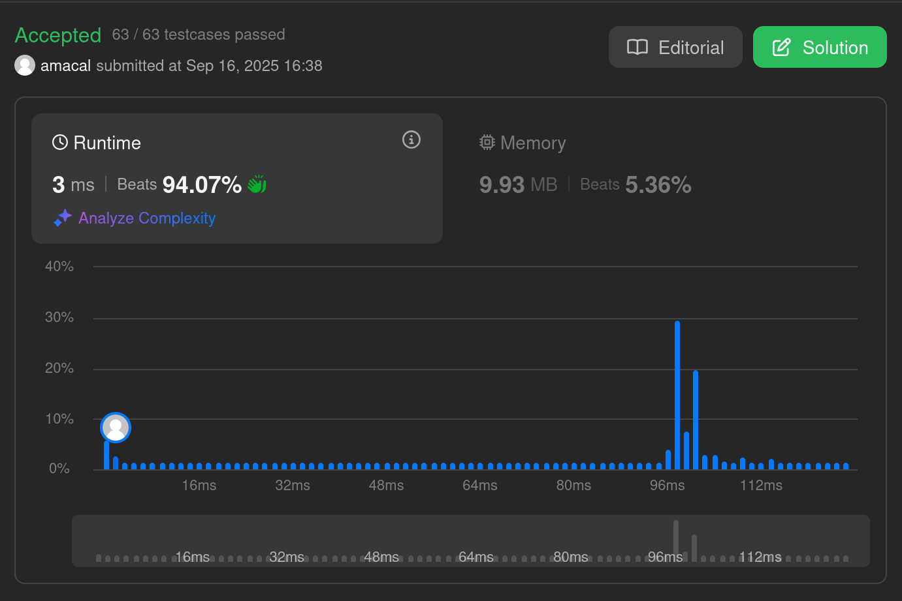
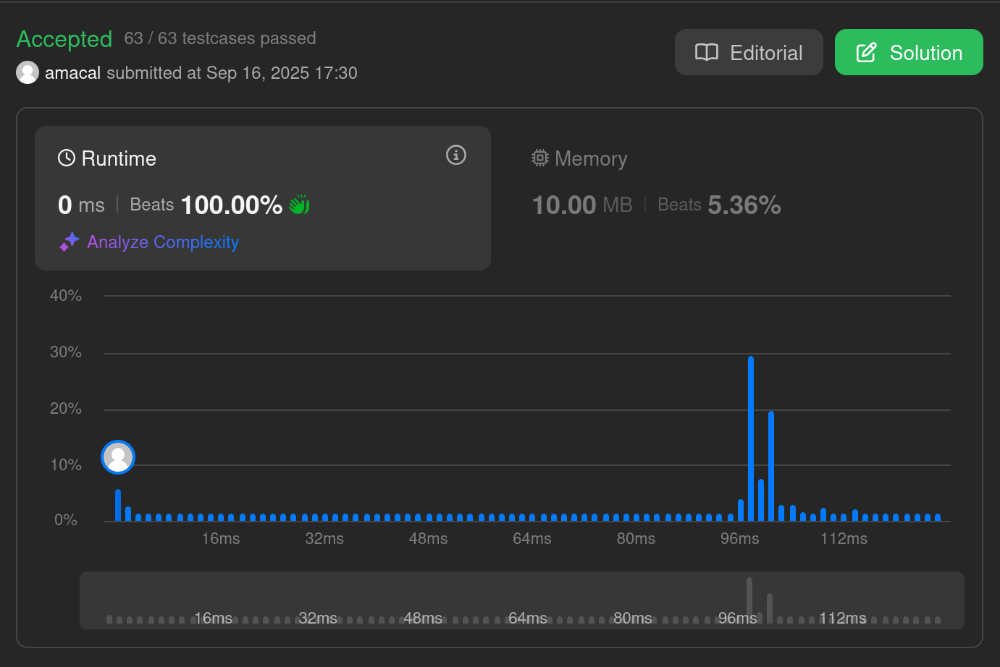

# two-sum

## radix + binary-search

Performance results reflect the algorithm’s structure: radix sort gives predictable, cache-friendly runtime behavior, explaining the favorable runtime percentile. Memory consumption is larger, as the implementation encodes values with indices in 64 bits and requires additional arrays for sorting.



``` c
#include <stdio.h>
#include <malloc.h>

void encode_indices(int size, uint* restrict src, unsigned long* restrict dst) {
    for (unsigned long i = 0; i < size; i++) {
        dst[i] = src[i] | (i << 32);
    }
}

void radix_sort_into(int* restrict histogram, int size, unsigned long* restrict src, unsigned long* restrict dst) {
    // flip MSB of the value
    for (int i = 0; i < size; i++) {
        src[i] = src[i] ^ 0x80000000;
    }

    // clear histogram
    for (int i = 0; i < 256 * 4; i++) {
        histogram[i] = 0;
    }

    // recompute it for all bytes
    for (int i = 0; i < size; i++) {
        histogram[0*256 + ((src[i] >>  0) & 0xff)]++;
        histogram[1*256 + ((src[i] >>  8) & 0xff)]++;
        histogram[2*256 + ((src[i] >> 16) & 0xff)]++;
        histogram[3*256 + ((src[i] >> 24) & 0xff)]++;
    }

    // convert histogram into cumsum
    for (int j = 0; j < 4; j++) {
        int prev = 0, value;

        for (int i = 0; i < 256; i++) {
            value = histogram[j*256 + i];
            histogram[j*256 + i] = prev;
            prev = prev + value;
        }
    }

    // actual sorting
    for (int j = 0; j < 4; j++) {
        int offset;
        int shift = j * 8;
        unsigned long *tmp;

        for (int i = 0; i < size; i++) {
            offset = j*256 + ((src[i] >> shift) & 0xff);
            dst[histogram[offset]] = src[i];
            histogram[offset]++;
        }

        tmp = src;
        src = dst;
        dst = tmp;
    }

    // flip MSB back
    for (int i = 0; i < size; i++) {
        src[i] = src[i] ^ 0x80000000;
    }
}

int binary_search(unsigned long *nums, int size, int target) {
    int min = 0, max = size - 1;

    while (min <= max) {
        int pivot = min + (max - min) / 2;

        if ((int)(nums[pivot] & 0xffffffff) == target) {
            return pivot;
        }

        if ((int)(nums[pivot] & 0xffffffff) > target) {
            max = pivot - 1;
        } else {
            min = pivot + 1;
        }
    }

    return -1;
}

void find_pair(unsigned long* nums, int size, int target, int* output) {
    for (int i = 0; i < size; i++) {
        int expected = target - (nums[i] & 0xffffffff);
        int index = binary_search(nums + i + 1, size - i - 1, expected);

        // expected not found
        if (index == -1) continue;

        // extracted encoded indices
        output[0] = nums[i] >> 32;
        output[1] = nums[index + i + 1] >> 32;

        return;
    }
}

int* twoSum(int* nums, int nums_size, int target, int* return_size) {
    int histogram[4*256];
    int *result = calloc(2, sizeof(int));
    unsigned long *tmp = calloc(2 * nums_size, sizeof(unsigned long));

    // keep indices together with values
    encode_indices(nums_size, nums, tmp);

    // sort by lower four bytes only
    radix_sort_into(histogram, nums_size, tmp, tmp + nums_size);

    // find matching pair
    find_pair(tmp, nums_size, target, result);

    // clean up
    free(tmp);

    *return_size = 2;
    return result;
}
```

## radix + two-pointers

Performance results reflect the algorithm’s structure: radix sort gives predictable, cache-friendly runtime behavior, while the two-pointer scan introduces a strictly linear, sequential access pattern. This explains the concentrated runtime percentiles, as memory access is stable and branch prediction trivial. Memory consumption remains larger due to index-value encoding in 64 bits and the additional arrays required for sorting.



``` c
#include <stdio.h>
#include <malloc.h>

void encode_indices(int size, uint* restrict src, unsigned long* restrict dst) {
    for (unsigned long i = 0; i < size; i++) {
        dst[i] = src[i] | (i << 32);
    }
}

void radix_sort_into(int* restrict histogram, int size, unsigned long* restrict src, unsigned long* restrict dst) {
    // flip MSB of the value
    for (int i = 0; i < size; i++) {
        src[i] = src[i] ^ 0x80000000;
    }

    // clear histogram
    for (int i = 0; i < 256 * 4; i++) {
        histogram[i] = 0;
    }

    // recompute it for all bytes
    for (int i = 0; i < size; i++) {
        histogram[0*256 + ((src[i] >>  0) & 0xff)]++;
        histogram[1*256 + ((src[i] >>  8) & 0xff)]++;
        histogram[2*256 + ((src[i] >> 16) & 0xff)]++;
        histogram[3*256 + ((src[i] >> 24) & 0xff)]++;
    }

    // convert histogram into cumsum
    for (int j = 0; j < 4; j++) {
        int prev = 0, value;

        for (int i = 0; i < 256; i++) {
            value = histogram[j*256 + i];
            histogram[j*256 + i] = prev;
            prev = prev + value;
        }
    }

    // actual sorting
    for (int j = 0; j < 4; j++) {
        int offset;
        int shift = j * 8;
        unsigned long *tmp;

        for (int i = 0; i < size; i++) {
            offset = j*256 + ((src[i] >> shift) & 0xff);
            dst[histogram[offset]] = src[i];
            histogram[offset]++;
        }

        tmp = src;
        src = dst;
        dst = tmp;
    }

    // flip MSB back
    for (int i = 0; i < size; i++) {
        src[i] = src[i] ^ 0x80000000;
    }
}

void find_pair(unsigned long* nums, int size, int target, int* output) {
    unsigned long *left = nums;
    unsigned long *right = nums + size - 1;

    while (left < right) {
        int expected = target - (int)(*left & 0xffffffff);
        int gap = (int)(*right & 0xffffffff) - expected;        

        if (gap == 0) {
            output[0] = *left >> 32;
            output[1] = *right >> 32;

            return;
        }

        if (gap > 0) {
            right--;
        } else {
            left++;
        }
    }
}

int* twoSum(int* nums, int nums_size, int target, int* return_size) {
    int histogram[4*256];
    int *result = calloc(2, sizeof(int));
    unsigned long *tmp = calloc(2 * nums_size, sizeof(unsigned long));

    // keep indices together with values
    encode_indices(nums_size, nums, tmp);

    // sort by lower four bytes only
    radix_sort_into(histogram, nums_size, tmp, tmp + nums_size);

    // find matching pair
    find_pair(tmp, nums_size, target, result);

    // clean up
    free(tmp);

    *return_size = 2;
    return result;
}
```

## hashmap

Performance results confirm the expected near-linear runtime of a hash table lookup strategy. Each value is inserted once and probed once, giving predictable behavior with almost no variance. The percentile distribution is concentrated at the very bottom, explaining the 0 ms median and 100% runtime ranking. Memory usage is higher than minimal, as the table stores both keys and chaining nodes, but it remains strictly linear in the input size.


``` c
#include <stdio.h>
#include <malloc.h>


static inline int hash_value(int value, int size) {
    return (0xc6a4a793u ^ (((unsigned int)value) * 0xc6a4a793u)) % size;
}

static inline int get_index(int *keys, unsigned long *values, int value, int size) {
    int hash = hash_value(value, size);
    int pointer = keys[hash];
    int prev = pointer;

    // look for matching value
    while (pointer != -1) {
        if ((int)(values[2 * pointer] & 0xffffffff) == value) {
            return (int)(values[2 * pointer] >> 32);
        }

        prev = pointer;
        pointer = (int)values[2 * pointer + 1];
    }

    // nothing found
    return -1;
}

static inline void insert_value(int *offset, int *keys, unsigned long *values, int index, int value, int size) {
    int hash = hash_value(value, size);
    int pointer = keys[hash];

    // fill out new node
    values[2 * *offset] = ((unsigned long)value & 0xffffffff) | (((unsigned long)index) << 32);
    values[2 * *offset + 1] = (unsigned long)pointer;
    *offset += 1;

    // append new node
    keys[hash] = *offset - 1;
}

int* twoSum(int* nums, int nums_size, int target, int* return_size) {
    int offset = 0;
    int *result = calloc(2, sizeof(int));

    int *keys = malloc(((nums_size + 1) & ~1) * (4 + 16));
    unsigned long *values = (unsigned long *)(keys + ((nums_size + 1) & ~1));

    // reset the map
    for (int i = 0; i < nums_size; i++) {
        keys[i] = -1;
    }

    for (int i = 0; i < nums_size; i++) {
        int expected = target - nums[i];
        int matched = get_index(keys, values, expected, nums_size);

        if (matched >= 0) {
            result[0] = i;
            result[1] = matched;
            break;
        }

        insert_value(&offset, keys, values, i, nums[i], nums_size);
    }

    // clean up
    free(keys);

    *return_size = 2;
    return result;
}
```